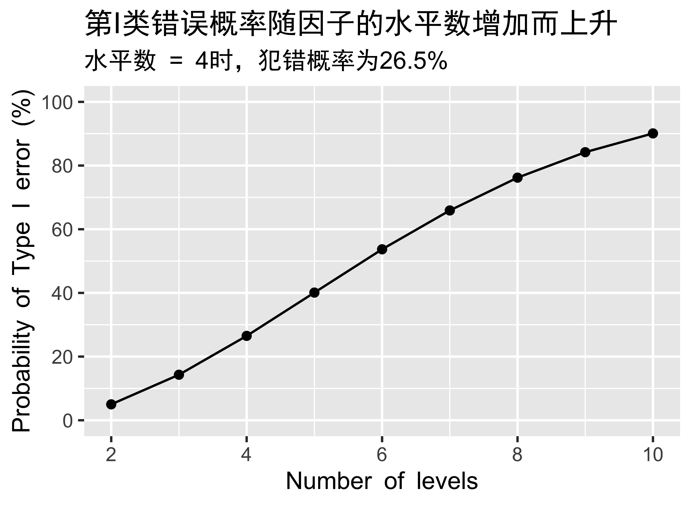
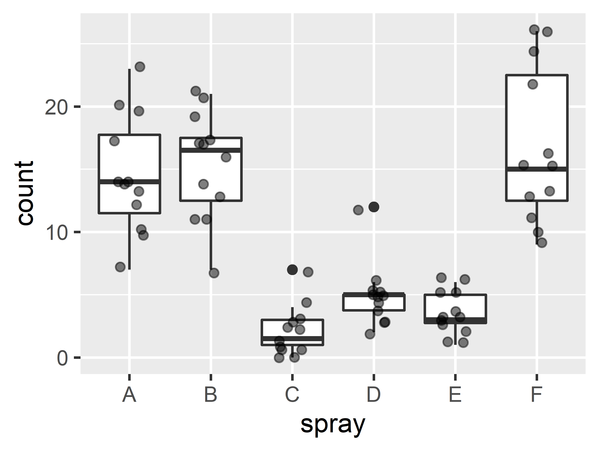
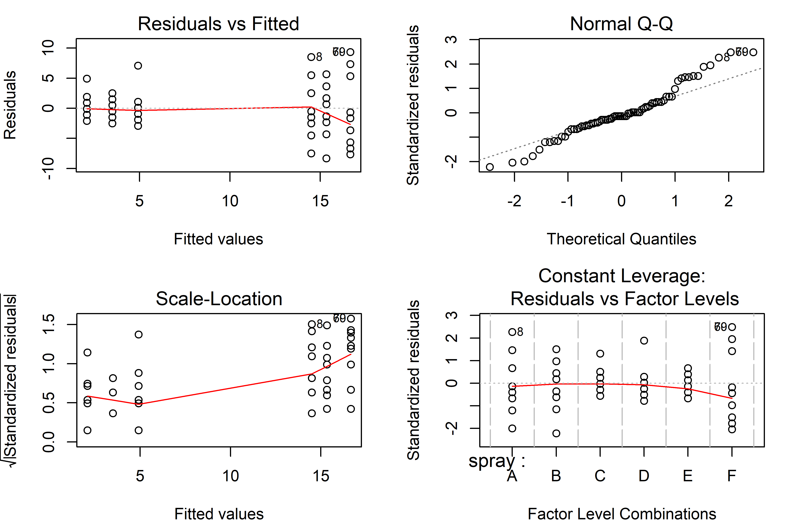
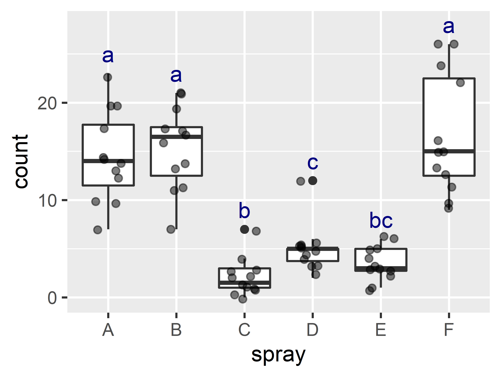
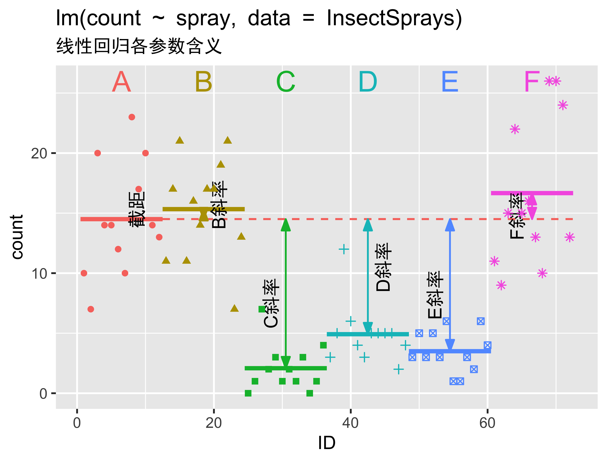

layout: true
  
<div class="my-footer"><span>Qiao-Guo Tan/CEE/XMU | tanqg@xmu.edu.cn | 2025-May-15   
&emsp;&emsp;&emsp;&emsp;&emsp;&emsp;&emsp;&emsp;&emsp;&emsp;&emsp;&emsp;&emsp;
&emsp;&emsp;&emsp;&emsp;&emsp;&emsp;&emsp;&emsp;&emsp;&emsp;&emsp;&emsp;&emsp;
</span></div> 

---

## 用到的程序包  

```{r message=FALSE}
library(tidyverse)
library(car) #方差齐性检验leveneTest
library(multcompView) #根据多重比较结果得到标注字母
library(jmv) # Welch's ANOVA + Games-Howell test
library(rstatix) # Welch's ANOVA`之后的post hoc检验，即Games-Howell test 
library(WRS2) # 稳健ANOVA
library(pgirmess) # 非参数ANOVA之后的post hoc检验，kruskalmc检验  
library(FSA) # 非参数ANOVA之后的post hoc检验，dunnTest检验  
```


---

### 为何不能用多次*`t`*检验替代`ANOVA`？  

.pull-left[
.large[
- *`t`*检验比较**两组**数据的均值  
- `ANOVA`比较**多组**数据的均值  

- 问：为什么不能用多次*`t`*检验替代`ANOVA`？ 
- 答：多次*`t`*检验会增加第I类错误（假阳性）的概率  
]]

.pull-right[
```{r eval=F, echo=F}
n <- 2:10
N_comp <- n*(n-1)/2
p_error1 <- round((1-0.95^N_comp)*100,1)
d_error1 <- data.frame(n, N_comp, p_error1)
p_error <- ggplot(d_error1, aes(n, p_error1))+
  theme_grey(base_family = "ArialHei")+
  geom_point()+
  geom_line()+
  labs(x="Number of levels",
       y="Probability of Type I error (%)",
       title="第I类错误概率随因子的水平数增加而上升",
       subtitle="水平数 = 4时，犯错概率为26.5%")+
  scale_y_continuous(breaks=seq(0,100,20), limits=c(0, 100))


#ggsave("type1error.png", width=391/90, height=286/90, dpi=900, unit="in")
#
png("type1error.png", width=391/90*600, height=286/90*600, res=600)
p_error
dev.off()

```

```{r echo=F, out.width=391*1.3, out.height=286*1.3}

```

]

---

### `ANOVA`的结果*`p`* < 0.05意味着什么？  
.large[

- *`p`* < 0.05则拒绝原假设

- **原假设**是各组的均值相等  

- 只要有任意两组的均值不等，*`p`*就小于0.05  

- 并不能明确知道哪两组存在显著差异  

- 需运用*`post hoc`*检验进行两两比较（大家通常对此更感兴趣）  
]

---

### `ANOVA`需满足条件  
.large[

1. **正态分布**：残差呈正态分布（接近于各组数据分别呈正态分布）,注意**不是**所有数据放在一起呈正态分布  

2. **方差齐性**：各组数据的方差相等  

3. **独立性**：样本之间需相互独立  

]

<br>

--

### 如果不满足条件，怎么办？

.large[
1. **数据转化**：取log，取平方根...  

2. **稳健方法**：Wilcox’s robust methods  

3. **非参数方法**： Kruskal–Wallis test 

]

---

### ANOVA本身是否稳健？

.large2[
* 当各组样本数量相等时，ANOVA是较为稳健的  

* 稳健是指即使数据**略有偏离正态分布**，**方差略有不齐**，对于分析的准确性影响不大  

* 设计实验时，尽量使各组的样本数相等，各treatment的replicate数相等  
]


???

Assumptions of ANOVA test

- 独立性 The observations are obtained independently and randomly from the population defined by the factor levels
- 正态分布  The data of each factor level are normally distributed.
- 齐方差性  These normal populations have a common variance. (Levene’s test can be used to check this.)


---

### 了解数据`InsectSprays`   

```r
?InsectSprays
```
> The counts of insects in agricultural experimental units treated with different insecticides.   

> A data frame with 72 observations on 2 variables..red[72行，6种杀虫剂，每种12个数据]  

> Source: Beall, G., (1942) The Transformation of data from entomological field experiments, Biometrika, 29, 243–262.  

.pull-left[
```{r}
head(InsectSprays)
```
]

.pull-right[
```{r}
unique(InsectSprays$spray) # 6种杀虫剂A、B、C、D、E、F
```
]

---

### 作图了解数据  

.pull-left[


```r
ggplot(InsectSprays, aes(spray, count))+
  geom_boxplot()+
  geom_jitter(width = 0.2, alpha = 0.5)

```

```{r echo=F, out.width=308*1.5, out.height=232*1.5}

```
]

.pull-right[
**说明**：  
- 该数据显示了6种不同杀虫剂的效果

- 以下用ANOVA分析不同杀虫剂的效果是否有显著区别  

]


---
class: inverse, middle, center
# 1
## 参数ANOVA

---

### 参数ANOVA的步骤  

.large[

1. 检验正态分布  

2. 检验方差齐性

3. 参数ANOVA  

4. *post hoc*检验  

5. 标注*post hoc*检验的结果  

6. 计算效应值  
]


---

### 正态分布检验：`shapiro.test()`    

- 要求残差呈正态分布，而非原始数据呈正态分布  

```{r}
aov.1 <- aov(count ~ spray, data = InsectSprays)
residuals <- aov.1$residuals #提取残差
shapiro.test(residuals) 
```


**解读**：
- *p* < 0.05， 残差不满足正态分布假设，应当考虑转化数据，或采用稳健方法、非参数方法  

- 但各组数据的样本数相等（都是12个），参数ANOVA比较稳健，一般仍可以用  

???
```{r}
##通过循环方法，一次性检验所有数据的正态分布 
## 未显示 
spray_name <- unique(InsectSprays$spray)  
p <- numeric(6)
for (i in 1:6) {
 d_i <- subset(InsectSprays, spray == spray_name[i]) 
 p[i] <- shapiro.test(d_i$count)$p.value
}
```

---

### 方差齐性检验：`leveneTest()`  

- `leveneTest()`：当数据不呈正态分布时可用  

- `bartlett.test()`，要求数据呈正态分布，否则基本相当于检验正态分布与否    

```{r message=F, warning=F}
car::leveneTest(count ~ spray, data = InsectSprays) 
```

**解读**：

- *p* = 0.004223 < 0.05, 不满足方差齐性假设，需考虑转化数据，或采用稳健方法、非参数方法  

- 但各组数据的样本数相等（都是12个），参数ANOVA比较稳健，一般仍可以用  


???
`bartlett.test()`
Bartlett's test is sensitive to departures from normality. That is, if the samples come from non-normal distributions, then Bartlett's test may simply be testing for non-normality. 

Levene's test and the Brown–Forsythe test are alternatives to the Bartlett test that are less sensitive to departures from normality.

---

### 参数方差分析：`aov()`函数


```{r highlight.output=2}
aov.1 <- aov(count ~ spray, data = InsectSprays)
summary(aov.1)
```


**解读**：不同杀虫剂的杀虫效果有显著差异（one-way ANOVA, *F*(5, 66) = 34.7, *p* < 0.001）。

---

### ANOVA的诊断  

.pull-left57[
```r
plot(aov.1)
```

```{r echo=F, out.width=631/1.1, out.height=484/1.1}

```
]

.pull-right57[

- 左上：方差齐性；

- 右上：正态分布；

- 左下、右下：异常点

]

---

background-image: url("figs/pregnant.jpg")
background-position: center
background-size: contain

---

### *post hoc*检验 
.large[
- 即多重比较（multiple comparison procedures），进行组间两两比较  

- 假阳性 vs. 假阴性  
  * 第I类错误 = 假阳性 = 无差异却检测出差异  
  
  * 第II类错误 = 假阴性 = 有差异却未检测出差异  
  
  * 将假阳性概率控制在5%（即α = 0.05）
  
  * 假阳性、假阴性的风险此消彼长，控制假阳性，则增加假阴性风险，损失统计效能（statistical power）
]


---

### 常用的*post hoc*检验方法


- 两两*t*检验（需控制第I类错误）: `pairwise.t.test(x, g, p.adjust.method = 以下代码)`
  * Bonferroni’s方法：代码`"bonferroni"`
  
  * Holm's方法：代码`"holm"`，效能高于Bonferroni
  
  * Benjamini–Hochberg方法：.red[代码`"BH"`，常用]，效能高于Holm’s方法  

- Tukey HSD方法：.red[`TukeyHSD()`：常用]，效能高于Dunn和Scheffé方法 
<br>
**稳健性**：

- 若偏离正态分布，多重比较方法大多仍然表现良好  

- 若组间样本数量不等或方差不齐，多重比较方法表现较差    


???

- When you have equal sample sizes and group variances are similar, use Tukey.
- If you want guaranteed control over the Type I error rate, then use Bonferroni.
- If there is any doubt that group variances are equal, then use a robust method (e.g., bootstrap or trimmed means)

???

- If Type I error control is your main concern then the bootstrap seems to offer a small advantage, 
- and if power is your concern then there are some benefits to methods based on M-estimators (Wilcox, 2003). 
- However, the bottom line is that using any of these methods is undoubtedly better than using a non-robust method.

---

### *post hoc*检验：`pairwise.t.test()`

```{r}
pairwise.t.test(InsectSprays$count, InsectSprays$spray, p.adjust.method = "BH")

```

**解读**：得到两两比较的*p*值矩阵；*p* < 0.05则表明两组之间存在显著差异。  

---

### *post hoc*检验：`TukeyHSD()`
.pull-left57[
```{r}
TukeyHSD(aov.1) #avo.1是以上aov()分析的结果  
```
]
.pull-right57[
**解读**：

- 第1列：哪两组均值相减  

- 第2-4列：差及其置信区间下限、上限，置信区间内不包括0则表示差异显著  

- 第5列：*p*值，< 0.05则表示差异显著
]

???

### Tukey另一种方法  

```r
library(multcomp)
postHocs<-glht(aov.1, linfct = mcp(spray = "Tukey"))
summary(postHocs)
confint(postHocs)
```


---

### 标注*post hoc*检验的结果-1  

```{r warning=F, message=F}
df_p <- (TukeyHSD(aov.1)$spray)[,4] #提取p值
mc_letter <- multcompView::multcompLetters(df_p, reversed = F) # 起核心作用的函数，根据p值，得到字母表示组间差异  
mc_letter #查看转化结果  

```

---

### 标注*post hoc*检验的结果-2  


.pull-left[

- **提取标注字母，生成数据表**  

```{r warning=F, message=F}
df_letter <- as.data.frame(mc_letter$Letters) #提取字母，转化为数据表待用
df_letter$spray <- rownames(df_letter) # 将处理组（spray）名称加入数据表
colnames(df_letter)[1] <- "abc" # 将数据表第1列重命名为abc，便于使用
head(df_letter)
```
]


.pull-right[

- **计算标注字母的y坐标，与字母数据表合并**  

```{r warning=F, message=F}
df_label <- InsectSprays %>%
  group_by(spray) %>%
  summarise(y_max = max(count)) %>% #计算各组的最大值，用于确定标注字母的位置
  left_join(df_letter, by = "spray") # 将字母数据表合并进来
head(df_label) 
```

]


???
# pairwise.t.test对应标注方法
# 字母标注缺第一组，第一组默认是a？
```r
ph3 <- pairwise.t.test(InsectSprays$count, InsectSprays$spray, p.adjust.method ="BH")
matrix_p <- ph3$p.value
# matrix_p[is.na(matrix_p)] <- FALSE
multcompLetters(matrix_p,  threshold=0.05)
```

---

### 标注*post hoc*检验的结果-3  

- **作图，用字母表示*post hoc*检验的结果**  

```r
ggplot(InsectSprays, aes(spray, count))+
  geom_boxplot()+
  geom_jitter(width = 0.2, alpha = 0.5)+
  geom_text(data = df_label, aes(spray, y_max + 2, label = abc), color = "navy") 
  
```

```{r echo=F, out.width=308*1.5, out.height=232*1.5}

```

???
# 另一种方法：
library(multcompView)
posthoc.1 <- glht(aov.1, linfct = mcp(spray = "Tukey"))
cld(posthoc.1, alpha=.05, Letters=letters)

https://rcompanion.org/rcompanion/d_08.html


generate_label_df <- function(HSD, flev){
 # Extract labels and factor levels from Tukey post-hoc 
 Tukey.levels <- HSD[[flev]][,4]
 Tukey.labels <- multcompLetters(Tukey.levels)['Letters']
 plot.labels <- names(Tukey.labels[['Letters']])

---

### 计算效应值  

$$ω^2=\frac{\text{SS}_\text{M}-df_\text{M}\cdot\text{MS}_\text{R}}{\text{SS}_\text{T}+\text{MS}_\text{R}}$$

```{r}
summary(aov.1)

# 从以上结果中提取平方和、自由度数据，代入公式，计算：
sqrt((2669 - 5 * 15.4)/(2669 + 1015 + 15.4))

```
**解读**：不同杀虫剂的杀虫效果差异较大（ω = 0.837）

???

Although in the sections on ANOVA I will use ω as my effect size
measure, think of it as you would r (because it’s basically an unbiased estimate of r anyway).
People normally report ω2, and it has been suggested that values of .01, .06 and .14 represent small, medium and large effects respectively (Kirk, 1996). Remember, though, that these are rough guidelines and that effect sizes need to be interpreted within the context of the research literature.

---

class: inverse, middle, center
# 2
### 符合正态分布，但方差不齐，采用
## Welch's ANOVA

---

### 若方差不齐，采用`Welch's ANOVA`  

- 与*t*检验类似，方差不齐可采用Welch's ANOVA   

```{r warning=F, message=F}
oneway.test(count ~ spray, data = InsectSprays)

```
<br>
**解读**：
不同杀虫剂的杀虫效果有显著差异（one-way ANOVA, Welch's *F*(5, 30.043) = 36.1, *p* < 0.001）。

???
Benefits of Welch’s ANOVA Compared to the Classic One-Way ANOVA
https://statisticsbyjim.com/anova/welchs-anova-compared-to-classic-one-way-anova/


---

### `Welch's ANOVA`之后的*post hoc*检验：`Games-Howell test`
```{r}
rstatix::games_howell_test(count ~ spray, data = InsectSprays)  
```
        

---

### `Welch's ANOVA + Games-Howell test`
```{r message=FALSE}
out <- jmv::anovaOneW(formula = count ~ spray, data = InsectSprays,
               phMethod = 'gamesHowell') # 查看帮助文档，可以设置一并做正态分布、方差齐性检验
out$anova
```


---

### `Welch's ANOVA + Games-Howell test`
```{r message=FALSE}
out$postHoc
```


???          
https://www.carlosivanrodriguez.com/guides/anova/welchs-anova/       
          

???
Although rather similar to Tukey’s test in its formulation, the Games-Howell test does not assume equal variances and sample sizes. 
The test was designed based on Welch’s degrees of freedom correction and uses Tukey’s studentized range distribution, denoted q. 
The Games-Howell test is performed on the ranked variables similar to other nonparametric tests. 
Since the Games-Howell test does not rely on equal variances and sample sizes, it is often recommended over other approaches such as Tukey’s test.

https://rpubs.com/aaronsc32/games-howell-test


### 也有推荐在Welch之后使用Dunnett检验  

```r
posthoc.2 <- glht(aov.1, linfct = mcp(spray = "Dunnett"))
summary(posthoc.2)
confint(posthoc.2)
```


---

class: inverse, middle, center
# 3
### 若不呈正态分布、方差不齐，则  
## 转化数据

---

### 常用的数据转化方法 

- **Log transformation** 对数转化  
  * 环境科学数据通常是对数正态分布，取对数后呈正态分布  
  * 常取自然对数或以10为底对数，两者对数据分析而言无差别  
  * 若原始数据有0或负数，需整体加上一个合适的数，使所有数据变为正数  

- **Square-root transformation** 平方根转化  
  * 通常用于计数数据    
  * 若原始数据有负数，需整体加上一个合适的数，使所有数据变为非负数  

- **Arcsine transformation** 反正弦转化  
  * 通常用于百分数、比例数据: $\text{Transformed Value} = \text{arcsin}(\sqrt{\text{Percentage}/100})$

```{r}
x <- c(0.001, 0.01, 0.1, 0.5, 0.9, 0.99, 0.999)
asin(sqrt(x))
```


**更多信息参考**：  
.small[
- McDonald, J. H. (2014). Handbook of Biological Statistics. 3rd edition. 
Data transformations. pp 141-145.  
- Salvatore S. Mangiafico. Summary and Analysis of Extension Program Evaluation in R. Transforming data. https://rcompanion.org/handbook/I_12.html
- Millard, S. P. (2014). EnvStats, an R Package for Environmental Statistics. Wiley StatsRef. Chapter 3 Looking at Data. (Box-Cox变换)
]

???
 there is a package called bestNormalize which will test out multiple "normalizing" transformations for you, you can try that if you want. If you inspect the log_x transformation it does exactly as I described, adds a small constant to every data point (max(0, -min(x) + eps)).
 
 
---

### 数据转化：取`log`     

```{r}
InsectSprays$log_ct <- log(InsectSprays$count + 1)
```


```{r}

residuals.2 <- aov(log_ct ~ spray, data = InsectSprays)$residual
shapiro.test(residuals.2)

```

**解读**：经对数转化后，残差符合正态分布（*p* > 0.05）  

---

### 数据转化：取`log`   

```{r}
car::leveneTest(log_ct ~ spray, data = InsectSprays) 
```
**解读**：对数转化后各组`count`方差具备齐性（*p* > 0.05） 

 
---

### 用转化后的数据进行参数方差分析    

.pull-left57[
```{r}
aov.2 <- aov(log_ct ~ spray, data = InsectSprays)
summary(aov.2)
df_p.2 <- TukeyHSD(aov.2)$spray
```

- **用字母表示显著性检验结果**：  
```{r}
multcompView::multcompLetters(df_p.2[,4], reversed = F) #

```
]

.pull-right57[
<br>
```{r echo=F, out.width=308*1.43, out.height=232*1.43}

```

]


---

class: inverse, center, middle
# 4
### 如数据不满足正态分布、方差齐性，可采用    
## 稳健ANOVA


---

### 稳健方法：`WRS2`程序包  

```{r}

WRS2::t1way(count ~ spray, data = InsectSprays) #?t1way了解更多信息
```

**解读**：不同杀虫剂的杀虫效果有显著区别（one-way ANOVA on trimmed means, *F*(5, 18.92) = 27.7923, *p* < 0.001）


---

### 稳健方法：`WRS2`程序包  

```{r warning=F}
WRS2::t1waybt(count ~ spray, data = InsectSprays, nboot = 599) #t1way的bootstrap版本

```

<br>

**此外还有**：`one-way ANOVA for the medians`

```r
WRS2::med1way(count ~ spray, data = InsectSprays)
```


---

### 稳健ANOVA的*post hoc*检验：`lincon()`  
 

```{r}
WRS2::lincon(count ~ spray, data = InsectSprays)

names(WRS2::lincon(count ~ spray, data = InsectSprays))
```

---

### `lincon()`*post hoc*检验：标注结果  

```{r}
comp <- WRS2::lincon(count ~ spray, data = InsectSprays)$comp
pvalue <- comp[,6] #提取p值
names(pvalue) <- paste0(comp[,1],"-",comp[,2]) #根据multcompLetters函数的格式要求，整理“A-B”格式的名称
mc_letter <- multcompView::multcompLetters(pvalue, reversed = F) #p值转化为字母
mc_letter #查看转化结果

WRS2::lincon(count ~ spray, data = InsectSprays)$fnames #各组名称
```


---

### 稳健ANOVA的*post hoc*检验：`mcppb20()`   

```{r}
WRS2::mcppb20(count ~ spray, data = InsectSprays, nboot = 5000)

```


---

class: inverse, middle, center
# 5
### 如数据不满足正态分布、方差齐性，可采用    
## 非参数ANOVA

---

### 非参数ANOVA：`Kruskal-Wallis Test`


```{r warning=F}
kruskal.test(count ~ spray, data = InsectSprays) 

```

---

### 非参数ANOVA的*post hoc*检验 |方法1: `pgirmess::kruskalmc()`  

```{r message=F}
pgirmess::kruskalmc(count ~ spray, data = InsectSprays)
```
---
### 非参数ANOVA的*post hoc*检验 |方法1: `pgirmess::kruskalmc()`  
#### *post hoc*检验：标注结果  

```{r}
dif.com <- (pgirmess::kruskalmc(count ~ spray, data = InsectSprays))$dif.com
pvalue <- ifelse(dif.com[, 3] == "TRUE", 0.04, 0.06) #生成p值，TRUE指<0.05,FALSE指>0.05
names(pvalue) <- rownames(dif.com)
mc_letter <- multcompView::multcompLetters(pvalue, reversed = F) #p值转化为字母
mc_letter #查看转化结果

```

---


### 非参数ANOVA的*post hoc*检验 | 方法2：`FSA::dunnTest()` 
```{r message=F}

FSA::dunnTest(InsectSprays$count, InsectSprays$spray)

```

???
## 也可以用dunn.test()，只是output格式不友好  
library(dunn.test)
dunn.test(InsectSprays$count, InsectSprays$spray, method="BH") 

---
### 非参数ANOVA的*post hoc*检验 | 方法2：`FSA::dunnTest()` 
#### *post hoc*检验：标注结果  

```{r}
res <- (FSA::dunnTest(InsectSprays$count, InsectSprays$spray))$res
pvalue <- res[,4] #提取p值
names(pvalue) <- gsub(" ", "", res$Comparison)
mc_letter <- multcompView::multcompLetters(pvalue, reversed = F) #p值转化为字母
mc_letter #查看转化结果

```

---
class: inverse, middle, center
# 6
## 方差分析是线性回归

---

### 方差分析是线性回归  


```{r}
mod.1 <- lm(count ~ spray, data = InsectSprays) #简单线性回归
summary(mod.1)
```

---

### 方差分析是线性回归：`lm()`结果等价于方差分析    

**线性回归的结果：**  
`count = 14.50 + 0.83 × sprayB - 12.42 × sprayC - 9.58 × sprayD - 11.00 × sprayE + 2.17 × sprayF`                    

`Spary A：Count = 14.50`  
`Spary B：Count = 14.50 + 0.83`  
`Spray C：Count = 14.50 - 12.42`  
`Spray D：Count = 14.50 - 9.58`  
`Spray E：Count = 14.50 - 11.00`  
`Spray F：Count = 14.50 + 2.17`  

- **截距**：是基准组（Spray A）的均值  

- **斜率**：各组均值与基准组的均值之差  

- 各组均值比整体均值可显著更好地描述数据（*F*(5, 66) = 34.7, *p* < 2.2e-16），换言之，组间均值存在显著差异。


---

### 方差分析是线性回归：作图理解两者关系  

.pull-left67[
```{r echo=F, out.width=450*1.5, out.height=343*1.5}

```
]
.pull-right67[

- **截距**：是基准组（Spray A）的均值  

- **斜率**：各组均值与基准组的均值之差  

]

```{r eval=F, echo=F}
##作图代码，不显示
library(dplyr)
library(ggrepel)
head(InsectSprays)
di <- InsectSprays

dim(InsectSprays)
di$ID <- 1:72

d_mean <- di %>%
  group_by(spray) %>%
  summarise(mean = mean(count)) %>%
  mutate(x1 = seq(0.5,60.5,12),
         x2 = seq(12.5, 72.5, 12),
         x3 = c(NA, x1[2:6]+6),
         x4 = x1 + 6,
         y1 = (mean + mean[1])/2,
         label=c("截距","B斜率","C斜率","D斜率",
                 "E斜率","F斜率"))


di$mean <- rep(d_mean$mean, each = 12)


p <- ggplot(di, aes(ID, count, color = spray, shape = spray))+
  theme_grey(base_family = "ArialHei")+
 
  geom_segment(data=d_mean, 
               aes(x=x1, xend=x2, y=mean, yend=mean),
               size=1.2)+
  geom_segment(x=12.5,xend=72.5, 
               y=d_mean$mean[1], 
               yend=d_mean$mean[1], 
               linetype="dashed", color="#F8766D", key_glyph = "blank")+
  geom_segment(data=d_mean, aes(x=x3, xend=x3, y=mean, yend=d_mean$mean[1]),
               arrow=arrow(angle = 20, 
                           type="closed",ends="both",
                           length = unit(0.1, "inches")))+
  geom_text_repel(data=d_mean, family = "ArialHei",
                  aes(x=x4, y=y1, label=label),
                  fontface="bold", color="black",
                  angle=90)+
  geom_text(data=d_mean, aes(x=x4, y=26, label=spray),family = "ArialHei",
            fontface="bold", size=6)+
  guides(color=F, shape=F)+
  geom_point()+
  labs(title="lm(count ~ spray, data = InsectSprays)",
       subtitle="线性回归各参数含义")
p
#ggsave("spray_2.png", width=450/90, height=343/90, dpi=600, unit="in")
#
#
#
#png("spray_2.png", width=450/90*600, height=343/90*600, res=600)
#p
#dev.off()
```


---

class: inverse, center, middle  

## 附：基础知识 


---

### 基础知识  


.pull-left[

- **总平方和**（每个值 - 总体均值）  

$$\text{SS}_\text{T}=\sum_{j=1}^m\sum_{i=1}^{n_j}({x_{ij}-\bar{x}_{\text{grand}})^2}$$

- **模型平方和** （各组均值 - 总体均值） 


$$\text{SS}_\text{M}=\sum_{j=1}^{m}n_j({\bar{x}_j-\bar{x}_{\text{grand}})^2}$$

- **残差平方和** （各组单个值 - 各组均值） 

$$\text{SS}_\text{R}=\sum_{j=1}^m\sum_{i=1}^{n_j}({{x}_{ij}-\bar{x}_{j})^2}$$

]

.pull-right[

- **模型平均平方和**  


$$\text{MS}_\text{M}=\frac{\text{SS}_\text{M}}{df_\text{M}}=\frac{\text{SS}_\text{M}}{m-1}$$
- **残差平均平方和**  

$$\text{MS}_\text{R}=\frac{\text{SS}_\text{R}}{df_\text{R}}=\frac{\text{SS}_\text{R}}{N-m}$$
- **统计量*F*值**  

$$F=\frac{\text{MS}_\text{M}}{\text{MS}_\text{R}}$$

]

*N*：总样本数；*n*：每组样本数；*m*：数据组数  

---

background-image: url("figs/spray_3.png")
background-position: center
background-size: contain


```{r eval=F, echo=F}
library(dplyr)
library(cowplot)

head(InsectSprays)
di <- InsectSprays

dim(InsectSprays)
di$ID <- 1:72

mean_grand <- mean(di$count)
d_mean <- di %>%
  group_by(spray) %>%
  summarise(mean=mean(count)) %>%
  mutate(x1=seq(0.5,60.5,12),
         x2=seq(12.5, 72.5, 12),
         x3=c(NA, x1[2:6]+6),
         x4=x1+6,
         y1 = (mean+mean[1])/2,
         label=c("截距","B斜率","C斜率","D斜率",
                 "E斜率","F斜率"))


di$mean <- rep(d_mean$mean, each=12)


p1 <- ggplot(di, aes(ID, count, color=spray, shape=spray))+
  theme_grey(base_family = "ArialHei")+
  geom_hline(yintercept = mean_grand,size=1.2, alpha=0.5)+
 
  geom_segment(data=d_mean, 
               aes(x=x1, xend=x2, y=mean, yend=mean),
               size=1.2)+
  geom_segment(aes(xend=ID),yend=mean_grand)+
 
  geom_text(data=d_mean, aes(x=x4, y=26, label=spray),
            fontface="bold", size=6)+
  guides(color=F, shape=F)+
  geom_point()+
  labs(title="总平方和"~SS[T])

p1
p2 <- ggplot(di, aes(ID, count, color=spray, shape=spray))+
  theme_grey(base_family = "ArialHei")+
  geom_hline(yintercept = mean_grand,size=1.2, alpha=0.5)+
  
  geom_segment(data=d_mean, 
               aes(x=x1, xend=x2, y=mean, yend=mean),
               size=1.2)+
  geom_segment(aes(xend=ID,yend=mean))+
  
  geom_text(data=d_mean, aes(x=x4, y=26, label=spray),
            fontface="bold", size=6)+
  guides(color=F, shape=F)+
  geom_point()+
  labs(title="残差平方和"~SS[R])

p2
p3 <- ggplot(di, aes(ID, count, color=spray, shape=spray))+
  theme_grey(base_family = "ArialHei")+
  geom_hline(yintercept = mean_grand,size=1.2, alpha=0.5)+
  
  geom_segment(data=d_mean, 
               aes(x=x1, xend=x2, y=mean, yend=mean),
               size=1.2)+
  geom_segment(aes(xend=ID,y=mean), yend=mean_grand)+
  
  geom_text(data=d_mean, aes(x=x4, y=26, label=spray),
            fontface="bold", size=6)+
  guides(color=F, shape=F)+
  geom_point()+
  labs(title="模型平方和"~SS[M])

p3
p_combined <- plot_grid(p1,p2,p3, nrow=1)

ggsave("spray_3.png", plot=p, width=957/90, height=300/90, dpi=600, unit="in")


png("spray_3.png", width=957/90*600, height=300/90*600, res=600)
p_combined
dev.off()

```

---

### 要点小结

- **经典参数ANOVA**：`aov()`  
  * *post hoc*： `TukeyHSD()`，`pairwise.t.test()`  

- **Welch's ANOVA**：`oneway.test()`  
  * *post hoc*：`rstatix::games_howell_test(Y ~ A, data)`  
  * *post hoc*：`jmv::anovaOneW(formula = Y ~ A, data, phMethod = 'gamesHowell')`

- **非参数ANOVA**：`kruskal.test()`  
  * *post hoc*：`pgirmess::kruskalmc()`，`FSA::dunnTest()`  
  
- **稳健ANOVA**：`WRS2::t1way()`，`WRS2::t1waybt()`，`WRS2::med1way()`  
  * *post hoc*：`WRS2::lincon()`，`WRS2::mcppb20()`    
  
---

background-image: url("figs/anova.png")
background-position: center
background-size: contain
 
---

## 参考文献：

.large[Field A., Miles J., Field Z. 2012. Discovering Statistics Using R. SAGE Publications Ltd. Chapter 10 Comparing several means: ANOVA; Chapter 15 Non-parametric tests.]


## 推荐阅读：

.large[

McDonald, J.H. 2014. Handbook of Biological Statistics, 3rd ed. Sparky House Publishing, Baltimore, Maryland.

Mangiafico, S.S. 2015. An R Companion for the Handbook of Biological Statistics, version 1.3.2. 
下载地址：http://biostathandbook.com/

]


